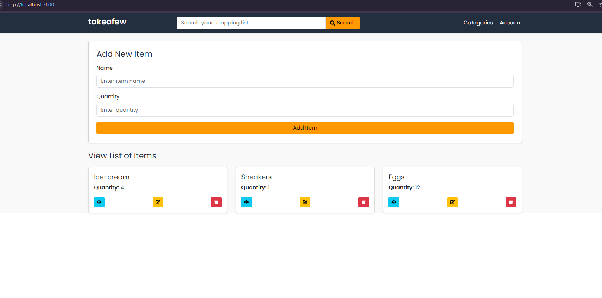
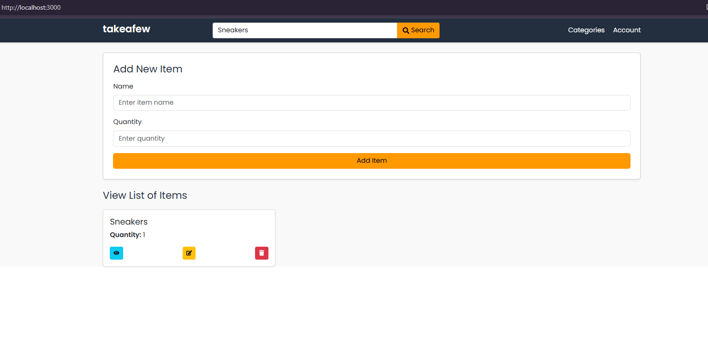

# takeafew - Smart Shopping List App

Welcome to **takeafew**, a simple yet powerful shopping list application designed to help you manage your grocery or shopping needs efficiently. Built with a modern web stack, this app provides an intuitive interface inspired by popular e-commerce platforms like Amazon, allowing you to add, edit, delete, and search for items with ease.

## Table of Contents
- [Features](#features)
- [Technologies Used](#technologies-used)
- [Installation](#installation)
- [Usage](#usage)
- [API Endpoints](#api-endpoints)


## Features
- **Add New Items**: Easily add items to your shopping list with name and quantity.
- **Edit Items**: Modify existing items in your list.
- **Delete Items**: Remove items you no longer need.
- **Search Functionality**: Search through your shopping list to find specific items quickly.
- **View Details**: View detailed information about each item in a modal popup.
- **Responsive Design**: Optimized for both desktop and mobile devices with a grid layout.
- **Amazon-Inspired UI**: Clean and modern interface with card-based item display.

## Technologies Used
- **Frontend**:
  - **ReactJS**: For building the user interface.
  - **Bootstrap**: For responsive and styled components.
  - **React-Toastify**: For user notifications.
  - **Font Awesome**: For icons.
  - **Google Fonts (Poppins)**: For custom typography.
- **Backend**:
  - **Node.js**: Server-side logic.
  - **Express**: Web framework for the API.
  - **Axios**: For HTTP requests to the backend.
- **Development**:
  - **npm**: Package management.
  - **Visual Studio Code**: Recommended IDE (or any preferred editor).

## Installation

### Prerequisites
- Node.js (v14.x or higher)
- npm (comes with Node.js)
- A code editor (e.g., Visual Studio Code)

### Steps
1. **Clone the Repository**
   ```bash
   git clone https://github.com/your-username/takeafew.git
   cd takeafew


2. **Install Dependencies for the frontend**
   ```bash
   cd shopping-list-api
   npm install


3. **Install Dependencies for the backtend**
   ```bash
   cd backend
   npm install


3. **Install Dependencies for the backtend**
   ```bash
   cd shopping-list-api
   npm start


3. **Install Dependencies for the backtend**
   ```bash
   cd backend
   npm node server.js


Open your browser and navigate to http://localhost:3000.


## Usage
- Adding an Item: Enter the item name and quantity in the "Add New Item" form and click "Add Item".
- Editing an Item: Click the edit icon (pencil) on an item card, modify the details, and submit.
- Deleting an Item: Click the trash icon on an item card to remove it.
- Viewing Details: Click the eye icon to see more details in a modal.
- Searching: Use the search bar at the top to filter items by name.


  



## API Endpoints
The app communicates with a Node.js backend. Below are the available endpoints:
- GET /shopping-list: Fetch all shopping list items.
- POST /shopping-list: Add a new item (requires { name, quantity } in the body).
- PUT /shopping-list/:id: Update an existing item (requires { name, quantity } in the body).
- DELETE /shopping-list/:id: Delete an item by ID.  